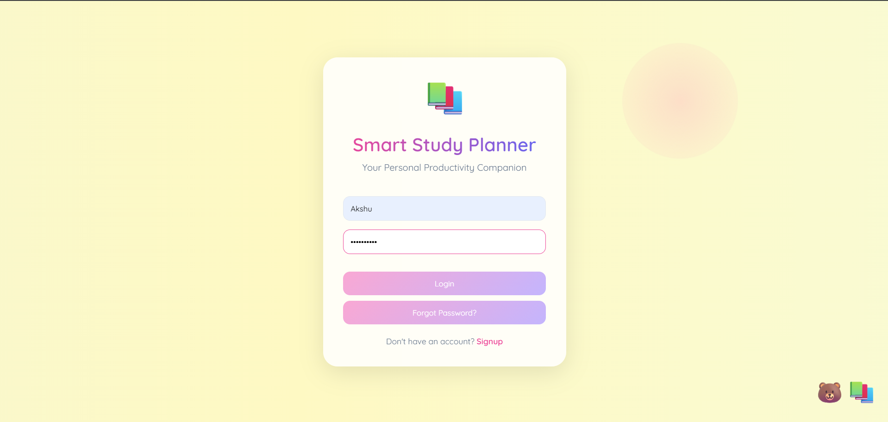
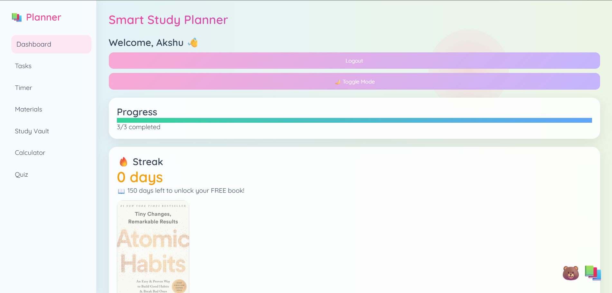
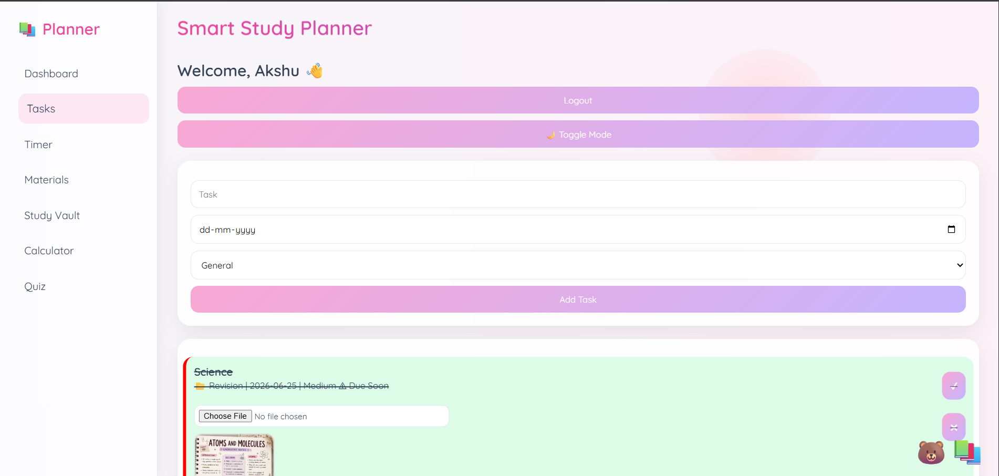
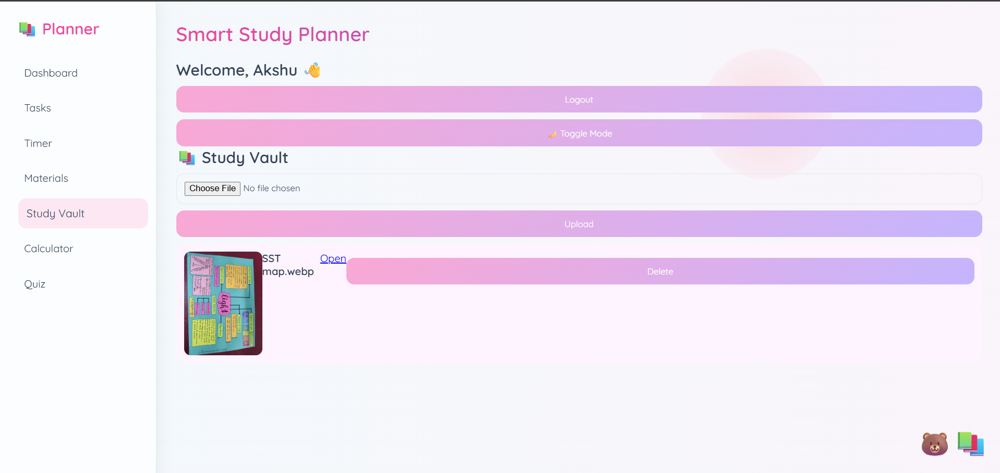
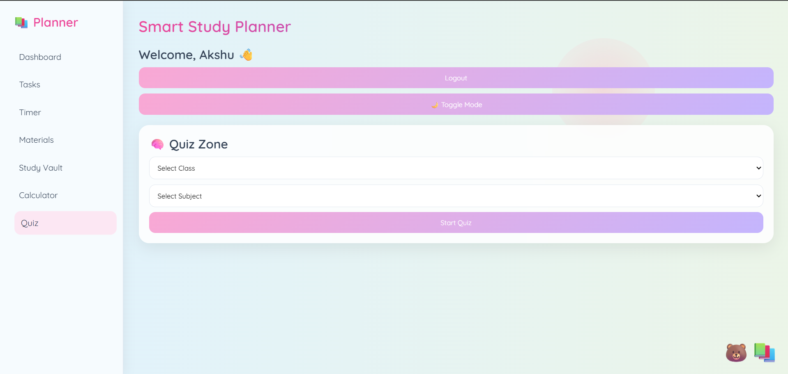
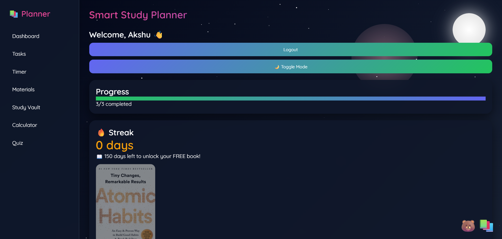

# 📚 Smart Study Planner
\

A modern student productivity and learning management system designed specifically for **Class 6–10 students**. Smart Study Planner helps learners organize tasks, stay focused, track progress, take quizzes, and manage study materials — all in one place.

---

## 🚀 Project Overview

Smart Study Planner is a browser-based web application that combines productivity tools and learning resources into a single platform.

Students often struggle with:

* Managing multiple assignments
* Staying focused during study sessions
* Tracking learning progress
* Organizing study materials
* Maintaining consistent study habits

This project solves these challenges through an intuitive and engaging interface designed specifically for school students.

---

## ✨ Features

### 🔐 User Authentication

* User Signup
* User Login
* Password Reset
* Personalized User Profiles

### 📋 Smart Task Manager

* Create and manage study tasks
* Set deadlines
* Organize tasks by category
* Mark tasks as completed
* Delete tasks
* Priority-based task sorting
* Overdue task detection

### 📊 Progress Dashboard

* Real-time task completion tracking
* Progress bar visualization
* Productivity analytics
* Doughnut chart using Chart.js

### 🔥 Study Streak System

* Daily study streak tracking
* Consistency rewards
* Motivation system
* Unlockable achievement milestones

### ⏱️ Study Timer

* Custom countdown timer
* Start/Stop controls
* Alarm notification on completion
* Focus session support

### 📚 Study Materials

* Materials for Classes 6–10
* Maths Notes
* Science Notes
* Quick access to educational resources

### 🗂️ Study Vault

* Upload PDFs
* Upload Images
* Store personal study materials
* Open and manage uploaded resources

### 🧠 Quiz Zone

* Subject-based quizzes
* Class-wise quizzes
* Self-assessment system
* Interactive learning experience

### 🧮 Calculator

* Built-in calculator
* Basic arithmetic operations
* Quick calculations while studying

### 🌙 Dark Mode

* One-click theme switching
* Animated night sky effect
* Enhanced night-time studying experience

### 💡 Motivation System

* Random motivational quotes
* Daily inspiration
* Productivity encouragement

### 📸 Proof of Completion

* Upload image proofs for completed tasks
* Visual accountability system

---

## 🎯 Target Audience

* Class 6 Students
* Class 7 Students
* Class 8 Students
* Class 9 Students
* Class 10 Students
* Students preparing for exams
* Learners building productive study habits

---

## 🛠️ Technologies Used

| Technology       | Purpose                |
| ---------------- | ---------------------- |
| HTML5            | Structure              |
| CSS3             | Styling & Animations   |
| JavaScript (ES6) | Functionality          |
| LocalStorage     | Data Persistence       |
| Chart.js         | Productivity Analytics |
| FileReader API   | Study Vault Uploads    |

---

## 🖥️ Screenshots


### Login Page


### Dashboard


### Task Manager


### Study Vault


### Quiz Zone


### Dark Mode

---

## 📂 Project Structure

```text
Smart-Study-Planner/
│
├── login.html
├── index.html
├── quiz.html
│
├── style.css
│
├── script.js
├── quiz.js
│
└── README.md
```

---

## ⚙️ Installation

### 1. Clone Repository

```bash
git clone https://github.com/yourusername/Smart-Study-Planner.git
```

### 2. Open Project Folder

```bash
cd Smart-Study-Planner
```

### 3. Launch Application

Open:

```text
login.html
```

in your browser.

No additional installation required.

---

## ▶️ Usage

### Step 1

Create an account using the Signup page.

### Step 2

Login with your credentials.

### Step 3

Add study tasks with deadlines and priorities.

### Step 4

Use the timer during study sessions.

### Step 5

Track progress on the dashboard.

### Step 6

Upload notes and resources to the Study Vault.

### Step 7

Practice using quizzes.

### Step 8

Maintain daily streaks and improve productivity.

---

## 💾 Data Storage

The project currently uses:

```javascript
LocalStorage
```

for storing:

* User Accounts
* Tasks
* Study Streaks
* Theme Preferences
* Uploaded Study Files
* Progress Data

All data remains on the user's device.

---

## 🌟 Unique Features

✅ Student-focused design

✅ Offline functionality

✅ Priority-based task sorting

✅ Daily streak system

✅ Animated dark mode

✅ Study material integration

✅ Study vault for notes

✅ Interactive quizzes

✅ Productivity analytics

✅ Motivational learning environment

---

## 🚀 Future Improvements

### Backend Integration

* User database
* Cloud synchronization

### AI Study Assistant

* Personalized recommendations
* Smart scheduling

### Mobile Application

* Android App
* iOS App

### Advanced Analytics

* Weekly reports
* Subject performance tracking
* Learning insights

### Notifications

* Task reminders
* Study alerts
* Deadline warnings

---

## 🎓 Learning Outcomes

This project helped demonstrate:

* Frontend Development
* DOM Manipulation
* Local Storage Management
* User Authentication
* Data Visualization
* UI/UX Design
* Responsive Web Development
* JavaScript Application Logic

---

## 🤝 Contributing

Contributions, suggestions, and improvements are welcome.

1. Fork the repository
2. Create a feature branch
3. Commit changes
4. Push to GitHub
5. Open a Pull Request

---

## 📄 License

This project is developed for educational and learning purposes.

---

## 👨‍💻 Author

**Akshu **

Student Developer | Web Development Enthusiast

### Project

**Smart Study Planner – Student Productivity & Learning Management System**

---

> "Technology should make learning smarter, simpler, and more enjoyable."
